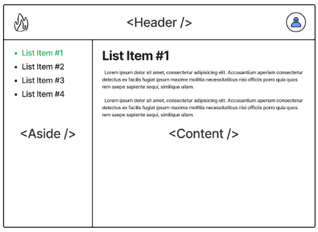

# Тестовое задание

> [Проверяющий преподаватель на курс "React" в Skillbox](https://hh.ru/vacancy/85598738)

## Задание №3

### Вам потребуется написать небольшое React приложение.



> #### Теребования к работе:
> - Ваше приложение имеет в левой колонке список тем, в центральной часте открывает их, если ни одна запись не выбрана, то просто белый экран. Есть заголовок, в котором есть логотип в левом углу и иконка юзера в правом. При нажатии на иконку юзера открывается popup в котором есть небольшая информации о пользователи.
> - Это приложение должно получать данные по http запросам. Для этого вы можете использовать [json-server](https://www.npmjs.com/package/json-server). Этого более чем хватит для получения данных.
> - Формат данных вы можете придумать любой, с которым вам будет удобнее работать.
> - Модальное окно должно быть реализовано через Portal
> - Дизайн не имеет сильного значения.
> - Вы можете собрать приложение используя CRA, Vite или собрать свою простую сборку Webpack (предпочтительнее).
> - Обязательно использовать TypeScript.
> - Каждая страница должна иметь свой routing чтобы можно было перейти по прямому url на статью, для этого используйте React Router.

---

### Запуск клиетнской части

Приложение написанно на `Vite`. Для запуска, скачайте репозиторий и вполните следующие команды:

```bash
npm ci
npm run dev
```

### Запуск серверной части

Приложение включает в себя [json-server](https://www.npmjs.com/package/json-server). Для запуска, во втором окное терминала вполните команду:

```bash
npm run server
```